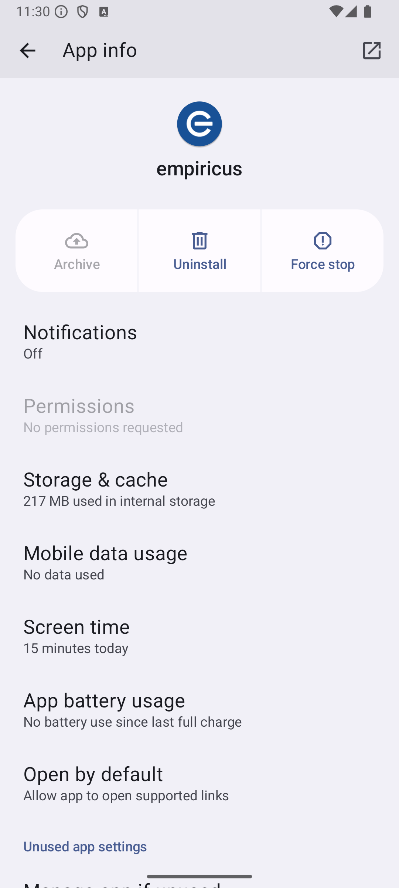
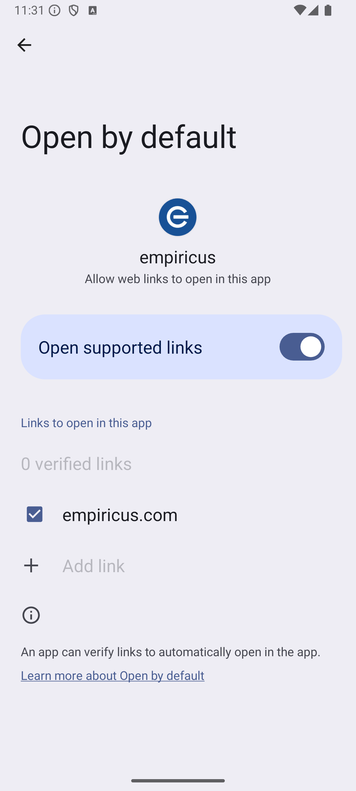

# Empiricus

Este é um aplicativo de material da Empiricus feito com Flutter, utilizando os pricipios do Clean Architecture, SOLID
e MVC para o gerenciamento de estado.

## Informações Para Login

Para logar no aplicativo, basta apenas utilizar as informações abaixo:

- **E-mail**: empiricus@gmail.com
- **Senha**: empiricus

Esses dados estão mockados na aplicação.

## Deep Link

O aplicativo possui um deep link para abrir qualquer telas do aplicativo, basta apenas utilizar os seguintes comandos:

### Android

#### login

```plaintext
adb shell 'am start -W -a android.intent.action.VIEW -c android.intent.category.BROWSABLE -d "https://empiricus.com/"'
```

#### home

```plaintext
adb shell 'am start -W -a android.intent.action.VIEW -c android.intent.category.BROWSABLE -d "https://empiricus.com/home"'
```

#### description

```plaintext
adb shell 'am start -W -a android.intent.action.VIEW -c android.intent.category.BROWSABLE -d "https://empiricus.com/home/description/slug"'
```

No lugar de `slug`, coloque o slug do artigo de investimento.

### iOS

#### login

```plaintext
/usr/bin/xcrun simctl openurl booted "applinks://empiricus.com/" 
```

#### home

```plaintext
/usr/bin/xcrun simctl openurl booted "applinks://empiricus.com/home" 
```

#### description

```plaintext
/usr/bin/xcrun simctl openurl booted "applinks://empiricus.com/home/description/slug" 
```

No lugar de `slug`, coloque o slug do artigo de investimento.

### Observação

Para utilizar o deep link, é necessário que o aplicativo esteja instalado no dispositivo, no android é necessário
configurar abrir por um deep link.



## Splash Screen

As telas de splash screen foram feitas de forma nativa, sem a utilização de plugins.

## Login

O login foi feito de forma mokada, sem a utilização de um backend, no caso de sucesso, o usuário é redirecionado para a
tela de listagem de artigos de investimento, caso contrário, é exibido um erro.

## Icone do Aplicativo

O ícone do aplicativo foi alterado para um ícone customizado, com a logo da Empiricus.

## Estrutura do Projeto

O projeto segue uma estrutura organizada em camadas, de acordo com os princípios do Clean Architecture.

## Funcionalidades

- **Login**: Realiza a autenticação do usuário de forma mokada.
- **Listagem de Artigos de Investimento**: Exibe uma lista de artigos de investimento.
- **Ver detalhes**: Mostra os detalhes mais especificos de cada um dos artigos de investimento.

## Tecnologias Utilizadas

- **Flutter**: Para o desenvolvimento de interfaces de usuário nativas.
- **Dio**: Gerenciamento de requisições HTTP.
- **GetIt**: Injeção de dependências.
- **Clean Architecture**: Estruturação do código em camadas de forma independente.

## Instalação e Execução

1. **Clone o repositório**:
   ```bash
   git clone https://github.com/pablostefan/empiricus.git
   ```

2. **Navegue até o diretório do projeto**:
   ```bash
   cd empiricus
   ```

3. **Instale as dependências**:
   ```bash
   flutter pub get
   ```

4. **Execute o aplicativo com o arquivo**:
    ```bash
    flutter run
    ```

## Estrutura de Pastas

```plaintext
lib/
├── app/                         # Ponto de entrada do aplicativo
├── core/                        # Recursos compartilhados e infraestrutura
│   ├── error/                   # Tratamento de erros e falhas
│   ├── infra/                   # Infraestrutura
│   │   └── http/                # Serviços HTTP
│   ├── utils/                   # Utilitários diversos
│   └── injection/               # Injeção de dependências
└── features/                    # Módulos do aplicativo
│   └── auth/                    # Módulo de autenticação
│   │   ├── data/                # Camada de dados
│   │   ├── domain/              # Camada de domínio
│   │   └── presentation/        # Camada de apresentação
│   └── investments/             # Módulo de investimentos
│       ├── data/                # Camada de dados
│       ├── domain/              # Camada de domínio
│       └── presentation/        # Camada de apresentação
└── l10n/                        # String internacionalizadas
└── shared/                      # Recursos compartilhados
```